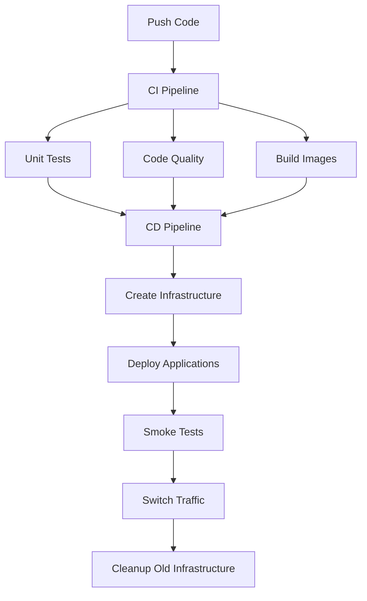

# CI/CD Pipeline Documentation

This document describes the Continuous Integration and Continuous Deployment (CI/CD) pipeline setup for the project, implementing a blue-green deployment strategy.

## Pipeline Overview

The project uses GitHub Actions with three deployment environments:

- **Development** (`develop` branch)
- **Staging** (`staging` branch)
- **Production** (`master` branch)

### Pipeline Architecture



## Required Configuration

### GitHub Secrets

1. **AWS Configuration**

   - `AWS_ACCESS_KEY_ID`: AWS access key
   - `AWS_SECRET_ACCESS_KEY`: AWS secret key
   - `SSH_PRIVATE_KEY`: SSH key pair for EC2 access

2. **Docker Hub**

   - `DOCKERHUB_USERNAME`: Docker Hub username
   - `DOCKERHUB_PASSWORD`: Docker Hub password

3. **Application Secrets**
   - `OPENAI_API_KEY`: OpenAI API key for analysis service

### GitHub Variables

1. **AWS Resource Tags**

```json
{
  "TAGS": [
    { "Key": "ApplicationName", "Value": "Resume Ranking" },
    { "Key": "Purpose", "Value": "MVP" },
    { "Key": "Project", "Value": "Resume Ranking" },
    { "Key": "Creator", "Value": "VectorNguyen" }
  ]
}
```

## Pipeline Components

### 1. Continuous Integration (`ci.yml`)

- Code quality checks using ruff
- Unit tests
- Frontend build verification

### 2. Continuous Deployment (`cd.yml`)

- Infrastructure provisioning with CloudFormation
- Blue-green deployment implementation
- Application deployment using Ansible
- Health checks and traffic switching
- Cleanup of old infrastructure

### 3. Environment-Specific Pipelines

#### Development Pipeline

**File:** [development_pipeline.yml](development_pipeline.yml)

- **Trigger:** Push to `develop` branch
- **Jobs:**
  - Run code quality checks (ruff)
  - Run unit tests
  - Build Docker images

#### Staging Pipeline

**File:** [staging_pipeline.yml](staging_pipeline.yml)

- **Trigger:** Push to `staging` branch
- **Jobs:**
  - Run CI checks
  - Deploy to staging environment
  - Automatic rollback on failure

#### Production Pipeline

**File:** [production_pipeline.yml](production_pipeline.yml)

- **Trigger:** Pull request to `master` branch
- **Jobs:**
  - Run CI checks
  - Deploy to production environment
  - Automatic rollback on failure

### 4. Rollback Process

The rollback workflow ([rollback.yml](rollback.yml)) is triggered automatically if deployment fails:

- Identifies failed deployment stack
- Removes newly created infrastructure
- Traffic remains routed to previous stable environment

## Deployment Process

### Infrastructure Creation

- Creates VPC, subnets, security groups
- Launches EC2 instance
- Sets up Application Load Balancer
- Configures SSL certificate

### Application Deployment

- Builds and pushes Docker images
- Configures EC2 instance using Ansible
- Deploys applications using Docker Compose

### Traffic Management

- Performs health checks
- Updates Route53 DNS records
- Switches traffic to new environment

### Cleanup

- Removes old infrastructure after successful deployment

## Infrastructure as Code

The infrastructure is defined using AWS CloudFormation:

- **Template:** [server.yml](cloudformations/server.yml)
- **Parameters:** Configurable via pipeline inputs
- **Resources:**
  - VPC and networking components
  - EC2 instances
  - Load balancer
  - SSL certificate
  - DNS configuration

## Usage

### Development Workflow

1. Create feature branch from `develop`
2. Push changes to trigger CI pipeline
3. Merge to `develop` for development deployment

### Staging Deployment

1. Merge `develop` to `staging`
2. Automated deployment to staging environment
3. Verify changes in staging

### Production Deployment

1. Create pull request to `master`
2. CI/CD pipeline runs automatically
3. Review and merge for production deployment

## Monitoring and Maintenance

### Health Checks

- Application endpoint monitoring
- Infrastructure health verification
- Automatic rollback on failure

### Cleanup

- Automatic removal of old infrastructure
- Resource tag-based management
- Cost optimization

## References

- [GitHub Actions Documentation](https://docs.github.com/en/actions)
- [AWS CloudFormation Documentation](https://docs.aws.amazon.com/cloudformation/)
- [Blue-Green Deployment Pattern](https://martinfowler.com/bliki/BlueGreenDeployment.html)
- [Ansible Documentation](https://docs.ansible.com/)
